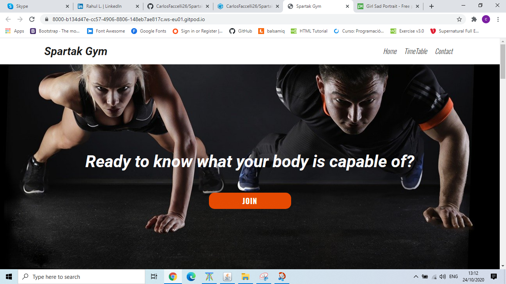
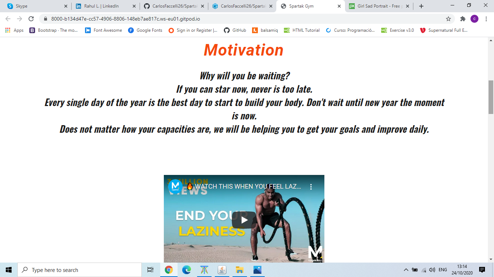
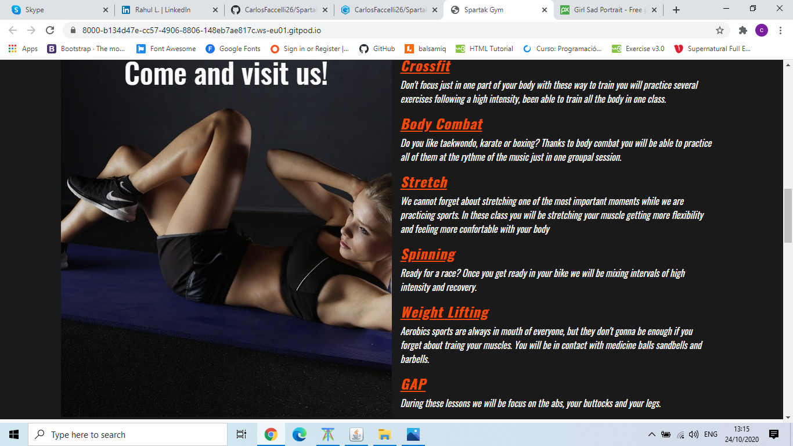
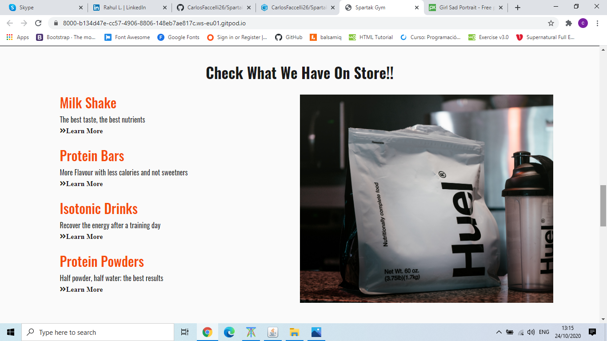
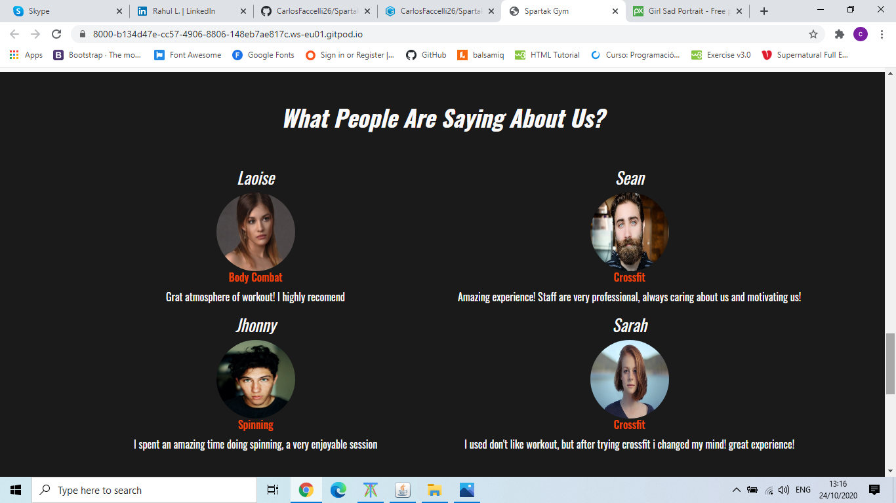
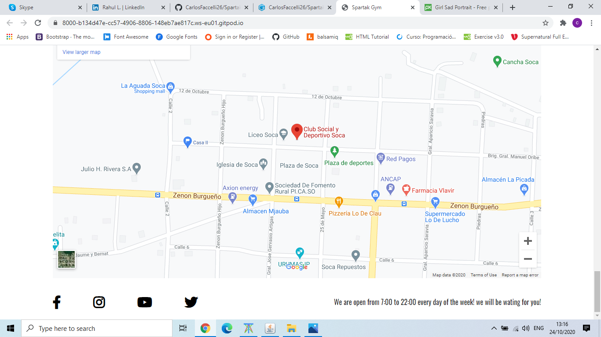

# Spartak-Gym-Project

Are you looking for the perfect website for your gym? You find it!!
Along this website you will find all the information that you need to let the people know like timetables, location, products...
Easy and simple, just with one click you will be able to access to every single pages which are part of the project.

# UX
If you are in the middle of the process to open a new gym, and you are still looking for a proper website, we can help you.
The main goal of the project is make a easy website which have been design focusing all the time on the future coustumers of the gym. People who does not go to the gym regulary. With this website we are trying to introduce them a new style of life. However we will help them to have the first contact with a gym and all the experiences that means (different options of workout, healthy products, pretty good instalations..). When this website was created, we did not forget neither about the staff and their main roll in the gym, so we want to let the people know that they will be supporting all the time with professionals in their fields. 
This website have been created thinking about you to cover all your needs.
It is not the first time we are selling our projects, however will not be a problem to show users experiences that we had before. 
I used Balsamiq to create a sketch of what the projet will look like, you will find the pdf on assets/project.pdf/SpartakGymProjectCodeInstitute.pdf

# Features

### Nav section
Our nav section contains three sites, which are home, timetabel and Contact. Home it will represent the main page, Timetable will lead to the schechule that the gym for each classes, and contact will give you the access to get in contact with the gym.

### Hero Motivation
Hero section consist in a shocking phrase to catch the attention and a huge image.

### Motivation section
There is a paragraph wich motivates you to give a chance to workout also we add a video showing giving more motivation.

### Exercise section
We show some of the diciplines that the gym provides and a brief description of what consist that dicipline.

### Products section
Products section contains a few stuff that the gym has to offer like milk shakes or bars proteins.

### Opinion section
Opinion section has a review from some costumers who went to the gym and express how they felt working out in Spartak Gym.

### TimeTable section
Time table shows a schechule of diciplines throughout the week.

### Contact section
Contact section provides a form to get in touch with the gym and ask something that they might interest in.

# Technologies used
[Bootstrap](https://getbootstrap.com/)
I used bootstrap to help me to creat a good layout.

[FontAwesome](https://fontawesome.com/)
FontAwesome was used to use the bar icon for the nav.

[GoogleFonts](https://fonts.google.com/)
Was used to change the font of the entire website.

[Balsamiq](https://balsamiq.com/wireframes/?gclid=Cj0KCQjwxNT8BRD9ARIsAJ8S5xaAbjJltmwD4q91nzDzQshYwxYDZuBzF_kJr_SYEDblnesiQi3-QnoaAipTEALw_wcB)
Used to create a sketch of the project.

# Testing

# Deployment

# Credits

### Images used on this Project
All the images are taking from a website called [pixabay](https://pixabay.com/) and [unsplash](https://unsplash.com/).

### Hero image

Image by <a href="https://pixabay.com/users/5132824-5132824/?utm_source=link-attribution&amp;utm_medium=referral&amp;utm_campaign=image&amp;utm_content=2264825">5132824</a> from <a href="https://pixabay.com/?utm_source=link-attribution&amp;utm_medium=referral&amp;utm_campaign=image&amp;utm_content=2264825">Pixabay</a>

### Hero image on mobile phone
Image by <a href="https://pixabay.com/users/pexels-2286921/?utm_source=link-attribution&amp;utm_medium=referral&amp;utm_campaign=image&amp;utm_content=1282232">Pexels</a> from <a href="https://pixabay.com/?utm_source=link-attribution&amp;utm_medium=referral&amp;utm_campaign=image&amp;utm_content=1282232">Pixabay</a>

### Exercise image
Image by <a href="https://pixabay.com/users/5132824-5132824/?utm_source=link-attribution&amp;utm_medium=referral&amp;utm_campaign=image&amp;utm_content=2250970">5132824</a> from <a href="https://pixabay.com/?utm_source=link-attribution&amp;utm_medium=referral&amp;utm_campaign=image&amp;utm_content=2250970">Pixabay</a>

### Products image
Photo by <a href="https://unsplash.com/@lime517?utm_source=unsplash&amp;utm_medium=referral&amp;utm_content=creditCopyText">Joseph Greve</a> on <a href="https://unsplash.com/s/photos/protein-powders?utm_source=unsplash&amp;utm_medium=referral&amp;utm_content=creditCopyText">Unsplash</a>

### Opinions Images.
First guy image
Image by <a href="https://pixabay.com/users/pexels-2286921/?utm_source=link-attribution&amp;utm_medium=referral&amp;utm_campaign=image&amp;utm_content=1845166">Pexels</a> from <a href="https://pixabay.com/?utm_source=link-attribution&amp;utm_medium=referral&amp;utm_campaign=image&amp;utm_content=1845166">Pixabay</a>

Second image guy
Image by <a href="https://pixabay.com/users/erik_lucatero-8817894/?utm_source=link-attribution&amp;utm_medium=referral&amp;utm_campaign=image&amp;utm_content=3353699">Erik Lucatero</a> from <a href="https://pixabay.com/?utm_source=link-attribution&amp;utm_medium=referral&amp;utm_campaign=image&amp;utm_content=3353699">Pixabay</a>

First girl image
Image by <a href="https://pixabay.com/users/jerzygorecki-2233926/?utm_source=link-attribution&amp;utm_medium=referral&amp;utm_campaign=image&amp;utm_content=2961959">Jerzy Górecki</a> from <a href="https://pixabay.com/?utm_source=link-attribution&amp;utm_medium=referral&amp;utm_campaign=image&amp;utm_content=2961959">Pixabay</a>

Second girl image
Image by <a href="https://pixabay.com/photos/?utm_source=link-attribution&amp;utm_medium=referral&amp;utm_campaign=image&amp;utm_content=919048">Free-Photos</a> from <a href="https://pixabay.com/?utm_source=link-attribution&amp;utm_medium=referral&amp;utm_campaign=image&amp;utm_content=919048">Pixabay</a>

### Motivation video
Video is taken from the chanel of [MotivationGrid](https://www.youtube.com/user/MotivationGrid)

### Acknowledgement
I received inspiration from [Colorlib](https://colorlib.com/wp/gym-websites-design/) [Fitness Factory](https://fitnessfactorymaine.com/)
